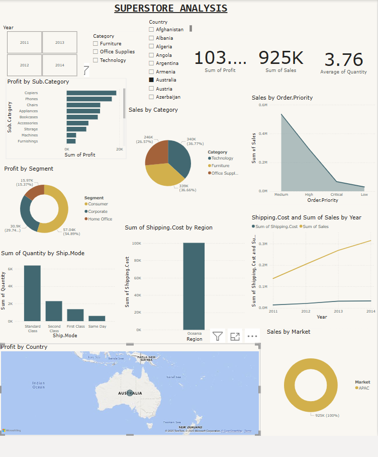
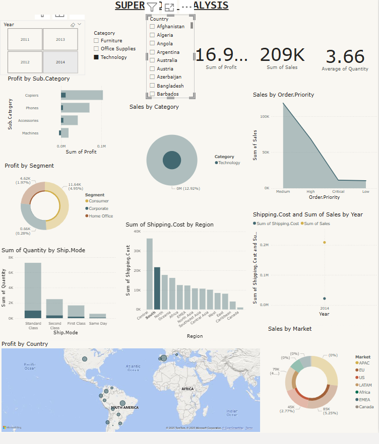
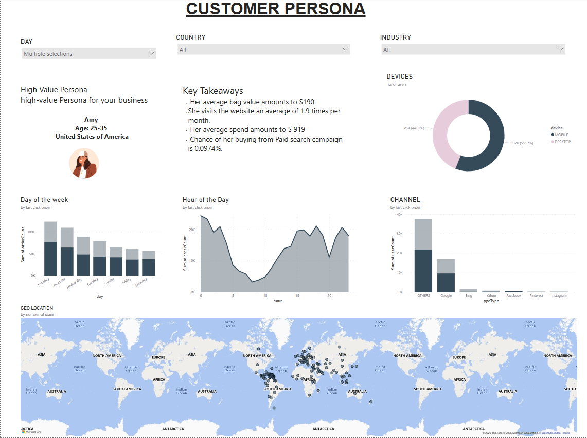
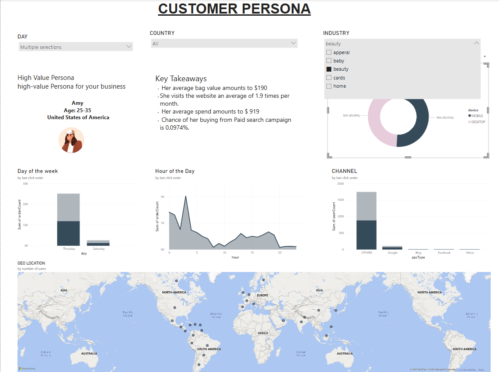
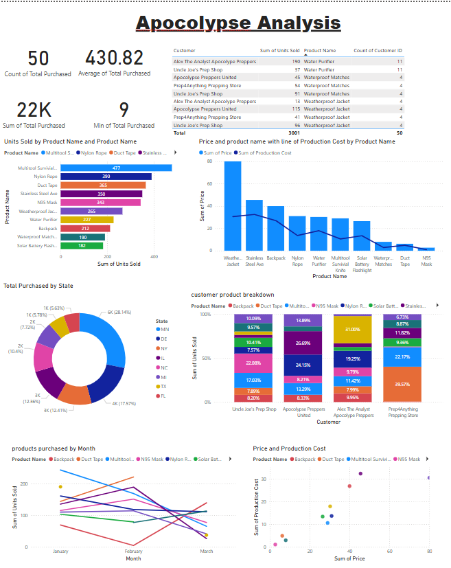
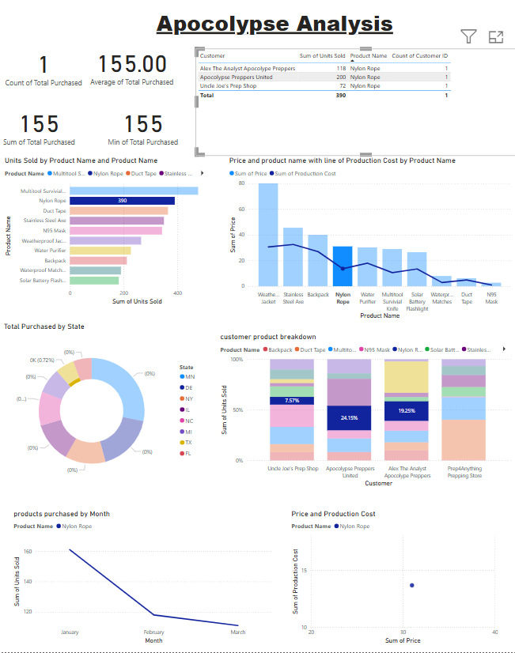

# **Power BI Projects**
portfolio with the analyzed data by using Data modeling, data visuals for insightful and interactive dashboards. 

## **SuperMarket**
- Analyze product sales, shipping logistics, and customer behavior to improve profitability, optimize transport modes, and align offerings with customer preferences.
-  Dataset Requirements (Key Columns)

Column Name	Description:
Order Date-	Date when the order was placed

Ship Date -	Date when the order was shipped

Ship Mode -	Mode of transport (Standard,First, secound, Same Day, etc.)

Product Category - Main category (e.g., Furniture, Technology)

Sub-Category - 	More specific product type

Segment	Customer type - (e.g., Consumer, Corporate)

Region	Geographic market - (e.g., East, West, Europe)

Sales -	Revenue from the sale

Profit - Net profit earned

Quantity - Units sold

### Visuals by selecting specific parameters using slicer:

## **Customer Persona**

- working on a project that involves analyzing customer data to identify business opportunities—particularly focusing on Product popularity (high-performing products),Profit and sales performance, and Customer interest areas or preferences.
- goal is to extract insights by category, analyze profit margins over time (daily/weekly) and understand which channels customers use to engage with the business. 

### Visuals by selecting specific industury names beauty outcome within a week:

## **Apocolypse visuals**

- Insightful dashboard that provides a clear view of your business's monthly sales performance across different states.
- Analysis of sales patterns over time to identify growth and products by the customers.

### Visuals by selecting specific parameters using slicer:

